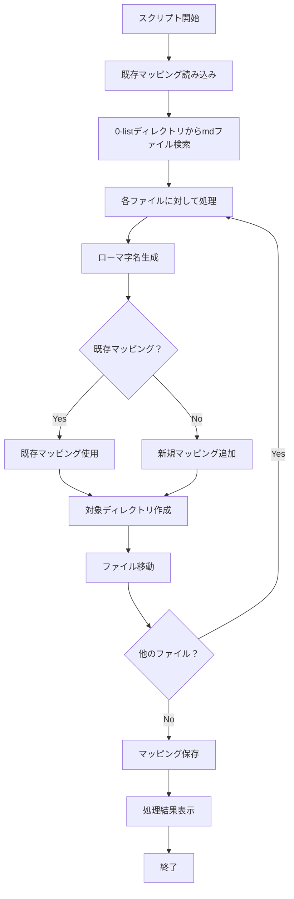

# 日本語ファイル名変換・移動スクリプト

## 概要

このスクリプトは、日本語の Markdown ファイル名をローマ字表記に変換し、`0-list`ディレクトリから対応するローマ字ディレクトリに移動するツールです。また、ファイル名の対応関係を`name_mapping.json`に自動で記録・更新します。

## 機能

- 🔄 日本語ファイル名の自動ローマ字変換
- 📁 対象ディレクトリの自動作成
- 📝 マッピング情報の JSON 管理
- 🔒 重複ファイルの上書き防止
- 📊 処理結果の詳細レポート

## ファイル構成

```
blog/
├── 0-list/              # 移動元ディレクトリ（日本語mdファイル）
├── 2-src/
│   └── name_mapping.json # ファイル名対応表
├── move_and_convert.py   # メインスクリプト
└── README.md
```

## 使用方法

### 基本実行

```bash
python3 move_and_convert.py
```

### 実行例

```bash
$ python3 move_and_convert.py
日本語mdファイルのローマ字変換・移動処理を開始します...
既存のマッピング 49 件を読み込みました
3 個のmdファイルを発見しました
新規追加: 新しいゲーム.md -> atarashii-gemu
移動完了: 新しいゲーム.md -> atarashii-gemu/
既存マッピング: 鳴潮.md -> meichou
移動完了: 鳴潮.md -> meichou/
name_mapping.json を更新しました (総計: 50 件)
2 個のファイルを移動しました
```

## 変換ルール

### 基本的な文字変換

| 日本語文字   | ローマ字 |
| ------------ | -------- |
| ー           | -        |
| ：           | -        |
| ・           | -        |
| （           | -        |
| ）           | (削除)   |
| ～           | -        |
| ！           | (削除)   |
| 　(全角空白) | -        |
| (半角空白)   | -        |

### 全角英数字

| 全角 | 半角 |
| ---- | ---- |
| Ａ   | a    |
| Ｒ   | r    |
| Ｘ   | x    |
| １   | 1    |
| ２   | 2    |
| ３   | 3    |

### 正規化処理

1. 連続するハイフンを単一に変換 (`--` → `-`)
2. 先頭・末尾のハイフンを削除
3. 全体を小文字に変換

## 処理フロー



## エラーハンドリング

- **ディレクトリ不存在**: `0-list`ディレクトリが存在しない場合、エラーメッセージを表示して終了
- **ファイル重複**: 移動先に同名ファイルが存在する場合、移動をスキップ
- **移動エラー**: ファイル移動中のエラーは捕捉し、詳細を表示

## name_mapping.json 形式

```json
{
  "日本語ファイル名.md": "romaji-filename",
  "鳴潮.md": "meichou",
  "ゼンレスゾーンゼロ.md": "zenless-zone-zero"
}
```

## 注意事項

- ⚠️ ファイル移動は元に戻せません。実行前にバックアップを推奨
- 📋 既存のマッピングがある場合は、それが優先されます
- 🔄 同一ファイルの重複実行は安全です（既存ファイルはスキップ）

## トラブルシューティング

### Q: ファイルが移動されない

A: 移動先に同名ファイルが既に存在している可能性があります。ログを確認してください。

### Q: マッピングが更新されない

A: `2-src/`ディレクトリの書き込み権限を確認してください。

### Q: 日本語変換が期待通りでない

A: `name_mapping.json`を手動編集して、正しいマッピングを追加してください。
